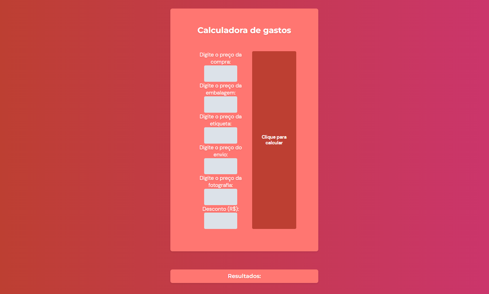

# Controle Interno de loja (Em andamento)

> Feito para André Mota

O projeto foi feito para controle interno de uma loja, ele possui calculadora que se adapta com valores de descontos, cadastro de clientes e área com histórico dos clientes utilizando os conceitos de JavaScript.

## [🔗 Clique aqui para acessar o projeto](https://loren175.github.io/Projeto-Andre)

#

## 🚀 Tecnologias

- HTML
- CSS
- JavaScript
- Git e Github

## 📞 Contato

> rafael.loren175@gmail.com

> +55 (11) 99959-9140

## 👾 Discord

> rafas#7622
